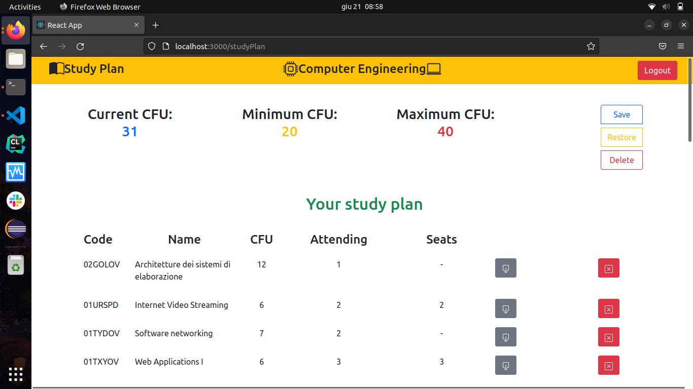
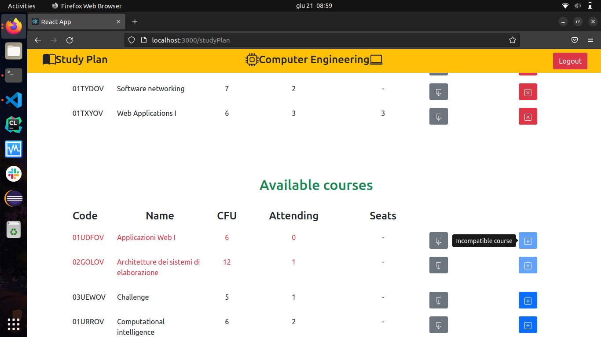

# Exam #1: "studyplan"
## Student: s296762 Gasco Diego 

## React Client Application Routes

- Route `/`: this route is the homepage of the application, an unauthenticated user can see all the available courses.
There is also a Navigation Bar on the top of the page where the unauthenticated user can search a course with a search form or can authenticate himself/herself with the 'Login' button that permits to navigate in the route `/login`.
- Route `/login`: this route permits to an user to authenticate himself/herself with a form where he/she can insert the credentials (username and password) and press the button 'Submit' to go on and arrive in the route `/studyPlan`.
In all cases a user navigates in this route (by logout, by manually insert the name in the browser bar, etc...), the eventually open session is interrupted and the user has to do another time the login operation.
In addiction there is the possibility to go back in the route `/` through the button 'Go Back' in the Navigation Bar.
- Route `/studyPlan`: this route shows to the user his/her study plan (it is the logged-in homepage). In the page we can find the student's plan and the list of available courses (with again all the information for each course). The Navigation Bar offers a button 'Logout' to do the logout action and return to the route `/login`.

## API Server

- POST `/api/sessions`
  - there are no request parameters and the request body contains the user session credentials in json format.
  - if the authentication went well the return status code is 201, and the body contains the user informations in json format, if the authentication went bad (username and/or password not correct) the return status code is 401 and the body contains error information.
- GET `/api/sessions/current`
  - there are no request parameters and the request body contains the user session credentials in json format.
  - if the user is correct authenticated the API returns with status 200 and user informations in json format, otherwise it returns a status code 404 and the body contains error information.
- DELETE `/api/sessions/current`
  - there are no request parameters and the request body contains the user session credentials in json format.
  - this API simply executes the Logout operation, the return status is 200 and there is no return body.
- GET `/api/courses`
  - there are no request parameters and no request body .
  - if there weren't errors the return status code is 200 with a body that contains all courses information in json format, if there were some errors the return status code is 500 and the body contains the error cause.
- GET `/api/course/:cid`
  - there is a request parameter that is the course id and there is no body.
  - if there weren't errors the return status code is 200 with a body that contains the course information in json format, if there were some errors the return status code is 503 and the body contains the error cause.
- GET `/api/user/courses`
  - there isn't any request parameter, the request credentials contains the user credentials for the authentication.
  - if there weren't errors the return status code is 200 with a body that contains the courses information that the logged student is enrolled-in in json format, if there were some errors the return status code is 500 and the body contains the error cause.
- POST `/api/user/studyPlan/:partTime`
  - the request parameter is the option the student chose for his/her part time option, the request credentials contains the user credentials for the authentication.
  - if there weren't errors the return status code is 201 with no body, if there were some errors the return status code is 503 and the body contains the error cause.
- POST `/api/user/update`
  - there is no request parameter, the request credentials contains the user credentials for the authentication and the request body contains a json array that contains the list of courses in the study plan saved by the student in the last update (first position of the array) and a list of the courses of the new study plan (second position in the array).
  - if there weren't errors the return status code is 201 with no body, if there were some errors the return status code is 503 and the body contains the error cause.
- DELETE `/api/user/studyPlan`
  - there is no request parameter, the request credentials contains the user credentials for the authentication and the request body contains a list of the courses present in the study plan saved by the student in the last update.
  - if there weren't errors the return status code is 204 with no body, if there were some errors the return status code is 503 and the body contains the error cause.
       
## Database Tables

- Table `users` 
  - id INTEGER (it's the primary key),
  - name VARCHAR(50),
  - surname VARCHAR(50),
  - email VARCHAR(50),
  - password VARCHAR(50),
  - salt VARCHAR(25),
  - part_time INTEGER (it can be 0 or 1)

- Table `courses`
  - id VARCHAR(7) (it's the primary key),
  - name VARCHAR(25),
  - CFU INTEGER,
  - max_students INTEGER,
  - enrolled_students INTEGER,
  - preparatory_course VARCHAR(7)
  
- Table `incompatibilities` 
  - course_A VARCHAR(7) (first part of the primary key),
  - course_B VARCHAR(7) (second part of the primary key)

- Table `users_courses` 
  - sid INTEGER (first part of the primary key),
  - cid VARCHAR(7) (second part of the primary key)

## Main React Components

- `Addictional` (in `Addictional.js`): this element is used by the `CourseRow` element to display the addictional constraints of a course, the incompatibilities and the preparatory course. It organizes this two features in a bullet list, where the codes and names of the courses that are constraints for the specific course in the row, are shown with another bullet list. 
For having the list of the courses that represent constraints for the sepcific row course, the API GET `/api/course/:cid` is called.
- `CourseRow` (in `CourseRow.js`): this element is called iteratively by `CourseTable` for making a row in the courses table. A row of tha table change between the route `/` and the route `/studyPlan`. In the first case we have the main information of the course and the addictional constraints (that we can expand with a button that if hoovered signals its purpose), in the second case we have a more complex situation: for the courses in the study plan the row has a button for the delete action, while for the available courses the row has a button for the add action. Both the add and delete buttons can be abled or disabled, depending on the constraints for that course (if that course can be added or deleted). Both buttons can be hoovered, like the addictional constraints button, to see the action if they are abled or the reason why they are disabled.
A row text is colored in black in a normal situation, while it is colored in red if a course cannot be added or deleted.
- `CourseTable` (in `CourseTable.js`): this element is used to create a table of courses, it sets the titles of the columns and called iteratively the element `CourseRow` for showing the courses.
- `Login` (in `Login.js`): this element presents a login form with whom the user can insert his/her email and password to create/see his/her study plan.
- `NavigationBar` (in `NavigationBar.js`): this element is a fixed-top navigation bar and has three different formats, one for each route.
  - For the route `/` we have a search form that permits to search by key words a course in the list of available courses. Near that there is a button 'Login' with whom the system navigates to the route `/login`.
  - For the route `/login` we have a button 'Go Back' with whom the user can return to the web site homepage.
  - For the route `/studyPlan` this element has an addicitonal decoration and a button 'Logout' to do the logout operation. Before loggin out, a popup ask again the user if he/she is sure to do this operation because all non-saved data will be lost, if the operation is confirmed, the system will do the logout and return on the `/login` route. 
- `NewStudyPlan` (in `NewStudyPlan.js`): this element is a Modal form that shows to the user his/her main information and ask to set a part time option. If the user decides to close it, the system performs the logout and returns to the login page, otherwise if the user forgets to insert a value for the part time option, a popup is shown for explaining the error and the registration form will be shown again.
Obviously this element is shown only if a user doesn't have a study plan yet.
- `StudyPlan` (in `StudyPlan.js`): this element manages the editing of a study plan. The user can see his/her current number of CFU and the bounds depending on his/her part time option.
There are three buttons for doing three different actions.
  - Save button -> a student can save the edited study plan if and only if the CFU constraints are satisfied, otherwise an error message is shown and the edited study plan is not saved.
  By closing the error message, the student can modify again the plan.
  - Restore button -> a student can decide to go back to the last version persistently saved of the study plan.
  - Delete button -> a student can decide to delete the last version saved of the study plan and also his/her part time option. Since this is a very delicate operation, a message is shown to confirm or not it.
The user can see all the courses in his/her study plan and all the available courses and decide which he/she wants to add or delete in the modality explained in the previous points.

For each element, when some asynchronous operations are done, a Spinner is activated.

## Screenshot

## Users Credentials

- username: s296762@studenti.polito.it, password: password1 -> he doesn't have his study plan yet
- username: s298754@studenti.polito.it, password: password2 -> he doesn't have his study plan yet
- username: s285697@studenti.polito.it, password: password3 -> he is a part time student
- username: s298454@studenti.polito.it, password: password4 -> he is a full time student
- username: s265835@studenti.polito.it, password: password5 -> he is a part time student
